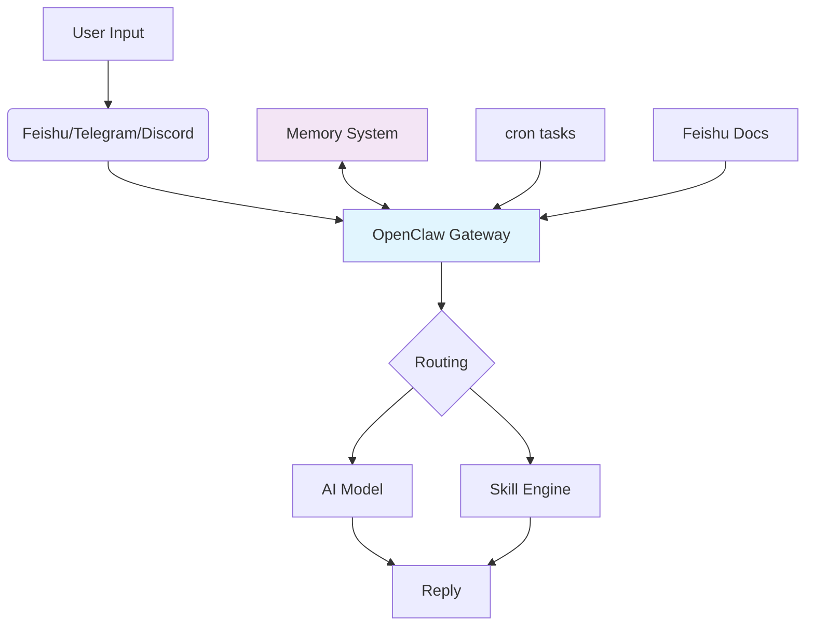

import { Callout } from 'nextra-theme-docs'

## Why Choose OpenClaw for PKM?

The core needs of a Personal Knowledge Management (PKM) system are: **Multi-source aggregation → Intelligent processing → Fast retrieval → Regular review**. OpenClaw, as a self-hosted AI gateway, provides exactly this infrastructure:

- ✅ **Multi-platform access**: Feishu, Telegram, Discord, etc., unified knowledge entry point
- ✅ **Flexible AI models**: OpenAI, Anthropic, Ollama local models
- ✅ **Automation**: cron tasks, heartbeat monitoring, event-driven
- ✅ **Skill extension**: Custom skills for unlimited functionality
- ✅ **Data sovereignty**: All data on your server, private and secure

This article will guide you from zero to a fully functional OpenClaw PKM system.

## System Architecture



**Core Components**:
1. **OpenClaw Gateway**: Message routing center
2. **Memory System**: Vector storage + semantic search
3. **Feishu Integration**: Document sync, notifications
4. **Skill Modules**: Auto-summarization, tagging, reports
5. **cron + heartbeat**: Scheduled tasks + monitoring

## 1. Environment Setup

### 1.1 Install OpenClaw

```bash
# macOS/Linux
curl -fsSL https://openclaw.ai/install.sh | bash

# Windows (WSL2 recommended)
curl -fsSL https://openclaw.ai/install.sh | bash
```

### 1.2 Initial Configuration

```bash
openclaw onboard --install-daemon
```

**Recommended setup**:
- AI Provider: Ollama (free local) or OpenAI API
- Gateway Token: Save securely
- System service: Auto-start enabled

## 2. Core Feature Implementation

### 2.1 Connect Feishu (Knowledge Source)

Install Feishu plugin:

```bash
openclaw plugins install feishu
```

Configure `~/.openclaw/config.json`:

```json
{
  "plugins": {
    "feishu": {
      "appId": "your_app_id",
      "appSecret": "your_app_secret",
      "encryptKey": "your_encrypt_key",
      "eventVerificationToken": "your_verification_token"
    }
  }
}
```

In Feishu developer console:
1. Enable `im:message`, `drive:readonly`, `docx:readonly` scopes
2. Configure Event Subscription URL: from `openclaw urls` Feishu Event URL
3. Set bot access to documents and groups

### 2.2 Memory System

OpenClaw has built-in memory management for knowledge retrieval:

```json
{
  "memory": {
    "enabled": true,
    "provider": "sqlite", // or "postgres", "redis"
    "maxEntries": 10000,
    "ttlDays": 30
  }
}
```

Memory automatically saves all conversations, supports semantic search:

```
User: @OpenClaw search for articles about OpenClaw installation
OpenClaw: Found 3 related memories...
```

### 2.3 Custom Skill: Auto-Summarization

Create skill `skills/summarize.js`:

```javascript
export const name = 'summarize';
export const description = 'Auto-generate document summaries';

export async function execute(ctx, args) {
  const { content } = args;
  
  // Call AI to generate summary
  const summary = await ctx.agent.generate(`Summarize in 100 words:\n${content}`);
  
  // Store in memory
  await ctx.memory.remember({
    type: 'summary',
    content: summary,
    source: args.title || 'unknown'
  });
  
  return { summary };
}
```

Register in `config.json`:

```json
{
  "skills": {
    "enabled": ["summarize", "tagify", "report"]
  }
}
```

### 2.4 cron Task: Daily Knowledge Report

Configure `config.json`:

```json
{
  "cron": {
    "enabled": true,
    "schedule": "0 9 * * *", // 9 AM daily
    "task": "daily-report"
  }
}
```

Create `skills/daily-report.js`:

```javascript
export const name = 'daily-report';
export const description = 'Generate daily knowledge report';

export async function execute(ctx) {
  // 1. Get yesterday's notes
  const yesterdayNotes = await ctx.feishu.listDocs(/* date filter */);
  
  // 2. Generate summaries
  const summaries = await Promise.all(
    yesterdayNotes.map(note => 
      ctx.agent.generate(`Summarize: ${note.content}`)
    )
  );
  
  // 3. Send report to group
  await ctx.feishu.sendMessage({
    chatId: "your_group_id",
    content: `📊 Daily Knowledge Report\n\n${summaries.join('\n\n')}`
  });
  
  return { success: true, count: yesterdayNotes.length };
}
```

### 2.5 heartbeat Monitoring

In `HEARTBEAT.md`:

```markdown
# Every 30 minutes

1. Check OpenClaw status: `openclaw status`
2. Check Feishu connection: `curl https://your-domain.com/api/plugins/feishu/events`
3. Check memory storage: `ls ~/.openclaw/memory/`
4. Send alert to Feishu group if issues
```

## 3. Complete Configuration Example

```json
{
  "gateway": {
    "port": 8080,
    "publicUrl": "https://your-domain.com"
  },
  "agent": {
    "name": "PKM Assistant",
    "systemPrompt": "You are a Personal Knowledge Management assistant helping users manage, retrieve, and summarize knowledge.",
    "avatar": "https://example.com/pkm-avatar.png"
  },
  "models": {
    "default": {
      "provider": "ollama",
      "model": "qwen2.5:7b",
      "baseURL": "http://localhost:11434"
    }
  },
  "plugins": {
    "feishu": {
      "appId": "xxx",
      "appSecret": "xxx",
      "encryptKey": "xxx"
    },
    "telegram": {
      "botToken": "xxx"
    }
  },
  "memory": {
    "enabled": true,
    "provider": "sqlite",
    "maxEntries": 10000,
    "ttlDays": 30
  },
  "skills": {
    "enabled": ["summarize", "tagify", "daily-report", "search"]
  },
  "cron": {
    "enabled": true,
    "schedule": "0 9 * * *",
    "task": "daily-report"
  },
  "channels": {
    "feishu": {
      "agent": {
        "name": "Feishu PKM Assistant",
        "systemPrompt": "Reply in Chinese on Feishu, be concise and clear."
      }
    }
  }
}
```

## 4. Deployment & Operations

### 4.1 Nginx Reverse Proxy (Production Required)

```nginx
server {
    listen 443 ssl http2;
    server_name your-domain.com;
    
    ssl_certificate /etc/letsencrypt/live/your-domain.com/fullchain.pem;
    ssl_certificate_key /etc/letsencrypt/live/your-domain.com/privkey.pem;
    
    location / {
        proxy_pass http://127.0.0.1:8080;
        proxy_http_version 1.1;
        proxy_set_header Upgrade $http_upgrade;
        proxy_set_header Connection "upgrade";
        proxy_set_header Host $host;
        proxy_set_header X-Real-IP $remote_addr;
        proxy_set_header X-Forwarded-For $proxy_add_x_forwarded_for;
        proxy_set_header X-Forwarded-Proto $scheme;
    }
}
```

### 4.2 systemd Service

Create `/etc/systemd/system/openclaw.service`:

```ini
[Unit]
Description=OpenClaw AI Gateway
After=network.target

[Service]
Type=simple
User=yourname
WorkingDirectory=/home/yourname/.openclaw
ExecStart=/usr/local/bin/openclaw gateway
Restart=always
RestartSec=10
LimitNOFILE=65536

[Install]
WantedBy=multi-user.target
```

Enable:

```bash
sudo systemctl daemon-reload
sudo systemctl enable openclaw
sudo systemctl start openclaw
sudo systemctl status openclaw
```

### 4.3 Monitoring & Logs

Real-time:

```bash
openclaw logs --follow
```

Scheduled checks:

```bash
*/30 * * * * openclaw status >> /var/log/openclaw/health.log
*/30 * * * * openclaw logs --level error --tail 5 >> /var/log/openclaw/errors.log
```

## 5. Real-World Use Cases

### Case 1: Quick Note-taking

After writing notes in Feishu doc, @mention the bot:

```
@PKM Assistant save this note to memory
```

Skill auto-extracts keywords, stores in vector DB, ready for semantic search later.

### Case 2: Knowledge Q&A

```
@PKM Assistant have I talked about OpenClaw installation before?
```

OpenClaw searches memory, finds relevant conversations, provides answer.

### Case 3: Daily Digest

Every 9 AM, bot sends yesterday's knowledge summary to Feishu group including:
- New document count
- Key topics
- Unread notes reminder

## 6. Optimization Tips

### 6.1 Performance

```json
{
  "cache": {
    "enabled": true,
    "maxSize": 1000,
    "ttl": 3600
  },
  "memory": {
    "provider": "postgres", // PostgreSQL for production
    "poolSize": 10
  }
}
```

### 6.2 Security

- Change default port (8080 → random)
- Enable API key auth
- Configure firewall (only 443 + custom port)
- Backup `~/.openclaw/` weekly

### 6.3 Skill Extensions

Build more:
- **Auto-tagging**: Tag documents automatically based on content
- **Document linking**: Discover relationships between docs
- **Knowledge graph**: Visualize knowledge network
- **Cross-platform sync**: Sync with Notion, Obsidian, etc.

## 7. Summary

OpenClaw's flexibility makes it an ideal foundation for PKM systems. Through this实战案例, you've learned:

- ✅ Connect Feishu as knowledge source
- ✅ Configure memory for semantic search
- ✅ Develop custom skills (summaries, reports)
- ✅ Set up cron automation
- ✅ Production deployment & monitoring

This system can be infinitely customized to your needs, becoming **your own AI-powered knowledge management platform**.

---

**Complete code examples** are in the配套仓库, including:
- All skill source code
- Full config files
- Deployment scripts
- Test data

Happy PKM journey! 🐋
