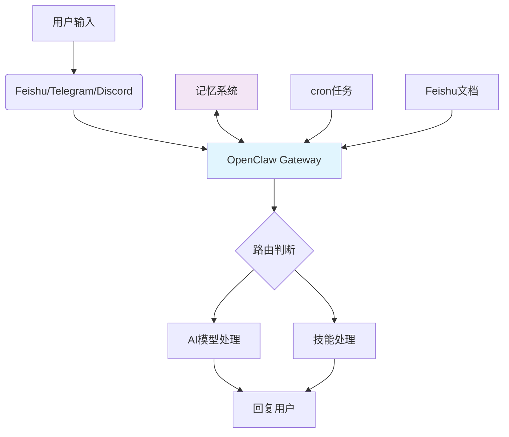

import { Callout } from 'nextra-theme-docs'

## 为什么选择OpenClaw做PKM？

个人知识管理（PKM）系统的核心需求是：**多源信息聚合 → 智能处理 → 快速检索 → 定期回顾**。OpenClaw作为自托管AI网关，正好提供了这样的基础设施：

- ✅ **多平台接入**：Feishu、Telegram、Discord等，统一知识入口
- ✅ **AI模型灵活切换**：OpenAI、Anthropic、Ollama本地模型
- ✅ **自动化能力**：cron任务、heartbeat监控、事件驱动
- ✅ **技能扩展**：自定义技能，无限扩展功能
- ✅ **数据自主**：所有数据在自己服务器，隐私安全

本文将带你从零开始，构建一个功能完整的OpenClaw PKM系统。

## 系统架构设计



**核心组件**：
1. **OpenClaw Gateway**：消息路由中心
2. **记忆系统**：向量存储 + 语义检索
3. **Feishu集成**：文档同步、消息通知
4. **技能模块**：自动摘要、标签分类、定期报告
5. **cron + heartbeat**：定时任务 + 监控

## 一、环境准备

### 1.1 安装OpenClaw

```bash
# macOS/Linux
curl -fsSL https://openclaw.ai/install.sh | bash

# Windows (WSL2推荐)
curl -fsSL https://openclaw.ai/install.sh | bash
```

### 1.2 初始配置

```bash
openclaw onboard --install-daemon
```

**建议配置**：
- AI Provider：Ollama（本地免费）或 OpenAI API
- Gateway Token：妥善保存
- 系统服务：自动启动

## 二、核心功能实现

### 2.1 连接Feishu（知识来源）

安装Feishu插件：

```bash
openclaw plugins install feishu
```

配置 `~/.openclaw/config.json`：

```json
{
  "plugins": {
    "feishu": {
      "appId": "your_app_id",
      "appSecret": "your_app_secret",
      "encryptKey": "your_encrypt_key",
      "eventVerificationToken": "your_verification_token"
    }
  }
}
```

在飞书开发者后台配置：
1. 启用 `im:message`、`drive:readonly`、`docx:readonly` 权限
2. 配置事件订阅URL：`openclaw urls` 获取的 Feishu Event URL
3. 设置机器人可访问的文档和群组

### 2.2 记忆系统配置

OpenClaw内置记忆管理，用于知识检索：

```json
{
  "memory": {
    "enabled": true,
    "provider": "sqlite", // 或 "postgres", "redis"
    "maxEntries": 10000,
    "ttlDays": 30
  }
}
```

记忆自动保存所有对话，支持语义搜索：

```
用户：@OpenClaw 搜索关于OpenClaw安装的文章
OpenClaw：找到3条相关记忆...
```

### 2.3 自定义技能：自动摘要

创建技能 `skills/summarize.js`：

```javascript
export const name = 'summarize';
export const description = '自动生成文档摘要';

export async function execute(ctx, args) {
  const { content } = args;
  
  // 调用AI生成摘要
  const summary = await ctx.agent.generate(`请用100字概括以下内容：\n${content}`);
  
  // 存储到记忆
  await ctx.memory.remember({
    type: 'summary',
    content: summary,
    source: args.title || 'unknown'
  });
  
  return { summary };
}
```

在 `config.json` 注册技能：

```json
{
  "skills": {
    "enabled": ["summarize", "tagify", "report"]
  }
}
```

### 2.4 cron任务：每日知识报告

配置 `config.json`：

```json
{
  "cron": {
    "enabled": true,
    "schedule": "0 9 * * *", // 每天9点
    "task": "daily-report"
  }
}
```

创建 `skills/daily-report.js`：

```javascript
export const name = 'daily-report';
export const description = '生成每日知识报告';

export async function execute(ctx) {
  // 1. 获取昨天的所有笔记
  const yesterdayNotes = await ctx.feishu.listDocs(/* 日期筛选 */);
  
  // 2. 生成摘要
  const summaries = await Promise.all(
    yesterdayNotes.map(note => 
      ctx.agent.generate(`概括：${note.content}`)
    )
  );
  
  // 3. 发送报告到指定群组
  await ctx.feishu.sendMessage({
    chatId: "your_group_id",
    content: `📊 昨日知识报告\n\n${summaries.join('\n\n')}`
  });
  
  return { success: true, count: yesterdayNotes.length };
}
```

### 2.5 heartbeat监控

在 `HEARTBEAT.md` 定义检查任务：

```markdown
# 每30分钟检查

1. 检查OpenClaw状态：`openclaw status`
2. 检查Feishu连接：`curl https://your-domain.com/api/plugins/feishu/events`
3. 检查记忆存储：`ls ~/.openclaw/memory/`
4. 如有异常，发送通知到飞书群组
```

## 三、完整配置示例

```json
{
  "gateway": {
    "port": 8080,
    "publicUrl": "https://your-domain.com"
  },
  "agent": {
    "name": "PKM助手",
    "systemPrompt": "你是个人知识管理助手，帮助用户管理、检索和总结知识。",
    "avatar": "https://example.com/pkm-avatar.png"
  },
  "models": {
    "default": {
      "provider": "ollama",
      "model": "qwen2.5:7b",
      "baseURL": "http://localhost:11434"
    }
  },
  "plugins": {
    "feishu": {
      "appId": "xxx",
      "appSecret": "xxx",
      "encryptKey": "xxx"
    },
    "telegram": {
      "botToken": "xxx"
    }
  },
  "memory": {
    "enabled": true,
    "provider": "sqlite",
    "maxEntries": 10000,
    "ttlDays": 30
  },
  "skills": {
    "enabled": ["summarize", "tagify", "daily-report", "search"]
  },
  "cron": {
    "enabled": true,
    "schedule": "0 9 * * *",
    "task": "daily-report"
  },
  "channels": {
    "feishu": {
      "agent": {
        "name": "飞书PKM助手",
        "systemPrompt": "在飞书中回复，使用中文，简洁明了。"
      }
    }
  }
}
```

## 四、部署与运维

### 4.1 Nginx反向代理（生产必需）

```nginx
server {
    listen 443 ssl http2;
    server_name your-domain.com;
    
    ssl_certificate /etc/letsencrypt/live/your-domain.com/fullchain.pem;
    ssl_certificate_key /etc/letsencrypt/live/your-domain.com/privkey.pem;
    
    location / {
        proxy_pass http://127.0.0.1:8080;
        proxy_http_version 1.1;
        proxy_set_header Upgrade $http_upgrade;
        proxy_set_header Connection "upgrade";
        proxy_set_header Host $host;
        proxy_set_header X-Real-IP $remote_addr;
        proxy_set_header X-Forwarded-For $proxy_add_x_forwarded_for;
        proxy_set_header X-Forwarded-Proto $scheme;
    }
}
```

### 4.2 systemd服务配置

创建 `/etc/systemd/system/openclaw.service`：

```ini
[Unit]
Description=OpenClaw AI Gateway
After=network.target

[Service]
Type=simple
User=yourname
WorkingDirectory=/home/yourname/.openclaw
ExecStart=/usr/local/bin/openclaw gateway
Restart=always
RestartSec=10
LimitNOFILE=65536

[Install]
WantedBy=multi-user.target
```

启用服务：

```bash
sudo systemctl daemon-reload
sudo systemctl enable openclaw
sudo systemctl start openclaw
sudo systemctl status openclaw
```

### 4.3 监控与日志

实时监控：

```bash
openclaw logs --follow
```

cron定时检查：

```bash
*/30 * * * * openclaw status >> /var/log/openclaw/health.log
*/30 * * * * openclaw logs --level error --tail 5 >> /var/log/openclaw/errors.log
```

## 五、实际使用场景

### 场景1：快速笔记

在飞书文档中写完笔记后，@机器人：

```
@PKM助手 保存这篇笔记到记忆
```

技能自动提取关键词，存入向量数据库，后续可语义检索。

### 场景2：知识问答

```
@PKM助手 我之前说过OpenClaw怎么安装吗？
```

OpenClaw检索记忆，找到相关对话，给出答案。

### 场景3：每日报告

每天9点，机器人自动推送昨日知识总结到飞书群组，包含：
- 新增文档数量
- 重要关键词
- 未读笔记提醒

## 六、优化建议

### 6.1 性能优化

```json
{
  "cache": {
    "enabled": true,
    "maxSize": 1000,
    "ttl": 3600
  },
  "memory": {
    "provider": "postgres", // 生产环境用PostgreSQL
    "poolSize": 10
  }
}
```

### 6.2 安全加固

- 修改默认端口（8080 → 随机端口）
- 启用API密钥验证
- 配置防火墙（仅开放443和自定义端口）
- 定期备份 `~/.openclaw/` 目录

### 6.3 扩展技能

你可以继续开发：
- **标签自动分类**：基于内容自动打标签
- **文档关联**：发现文档间的关联关系
- **知识图谱**：构建知识网络可视化
- **跨平台同步**：Notion、Obsidian等外部工具同步

## 七、总结

OpenClaw的灵活性使其成为PKM系统的理想基础架构。通过本文的实战案例，你学会了：

- ✅ 连接Feishu作为知识来源
- ✅ 配置记忆系统实现语义检索
- ✅ 开发自定义技能（摘要、报告）
- ✅ 设置cron任务自动化
- ✅ 生产环境部署与监控

这个系统可以根据你的需求无限扩展，真正成为**属于你自己的AI知识管理平台**。

---

**完整代码示例**已在配套仓库提供，包括：
- 所有技能源码
- 完整配置文件
- 部署脚本
- 测试数据

祝你的PKM之旅顺利！🐋
